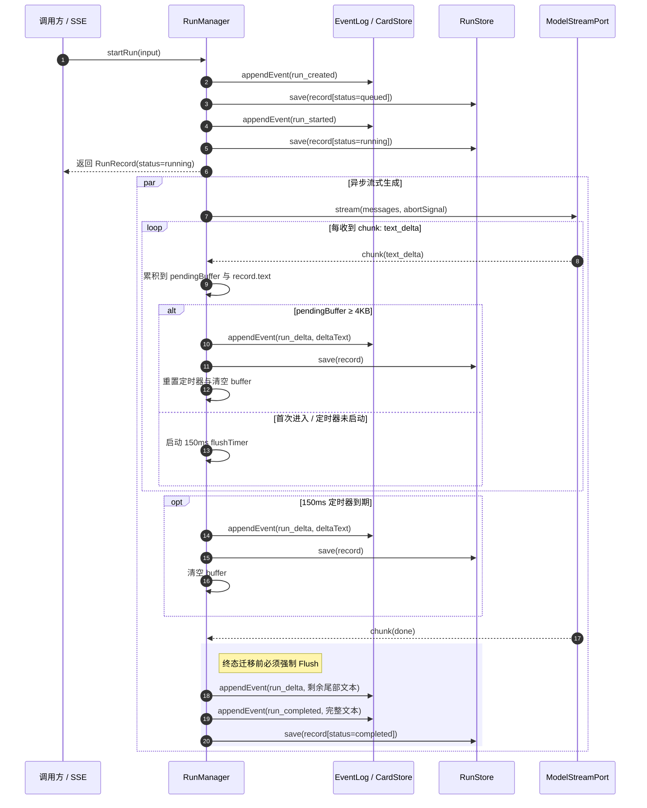
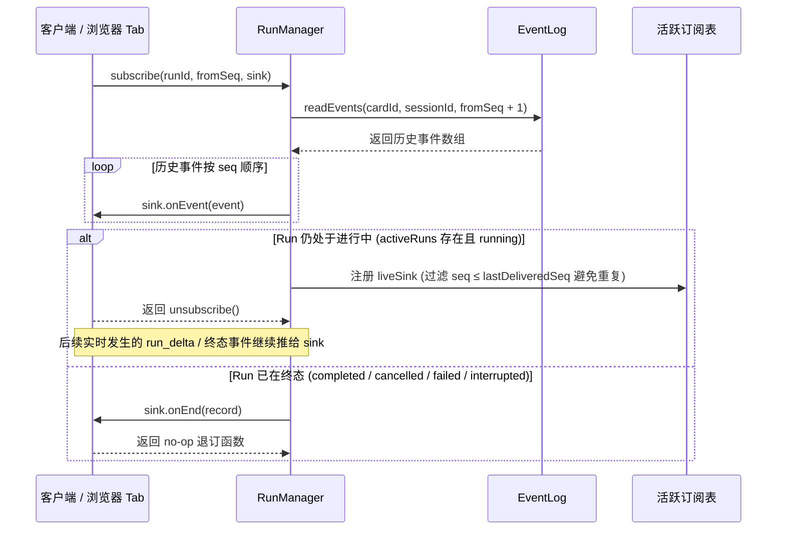

# AIRP 阶段 2「生成生命周期：Run 状态机 / 取消 / 断线 reattach / kill -9 恢复」交付文档

本文档记录 AIRP 项目阶段 2「生成生命周期」模块（RunManager、RunStore、MockModelPort 及其与底层事件日志与快照基础设施的协同）的架构设计、状态机、落盘节流时序、reattach 机制、跨进程强杀恢复等价性说明以及任务书要求的 9 项核心验收标准的自动化测试验证证据。

---

## 一、文件清单与职责

本阶段实现严格在任务书划定的文件边界内实施，未动任何禁改文件（未修改 `package.json`、`tsconfig.json`、`vitest.config.ts`、`src/runtime/contracts.ts`、`src/core/**`、`src/runtime/store/**` 等），未新增第三方依赖，严格遵守 ESM、NodeNext 规范（相对路径带 `.js` 后缀）及 TypeScript Strict 模式：

1. **`src/runtime/session/run-store.ts`**
   - 职责：RunRecord 元数据持久化层。
   - 核心能力：
     - 依据契约常量 `SESSION_LAYOUT.runs` 将元数据保存在 `<AIRP_HOME>/cards/<cardId>/sessions/<sessionId>/runs/<runId>.json`；
     - 采用同目录临时文件 + `rename` 原子写（支持 Windows 下并发文件锁的指数退避重试）；
     - 提供 `save(record)`、`load(cardId, sessionId, runId)`、`list(cardId, sessionId)`、`listAllCardRuns(cardId)` 与 `listAllRuns()` 全局扫描。
2. **`src/runtime/session/mock-port.ts`**
   - 职责：模型端口适配层。
   - 核心能力：
     - 使用 `src/core/adapters/mock-model.ts` 的 `MockModelAdapter` 实现 `ModelStreamPort` 契约；
     - 将适配器事件（start / text_delta / done / tool_call）映射转换为 `ModelStreamChunk`；
     - 透传 `abortSignal`，在流生成过程中及时响应取消；支持可配置的 `deltaDelayMs` 模拟慢速流。
3. **`src/runtime/session/run-manager.ts`**
   - 职责：Run 状态机、生成生命周期协调、增量落盘节流、取消控制、reattach 订阅与系统重启恢复。
   - 核心能力：
     - **write-ahead 状态迁移**：每次状态变化（queued -> running -> completed / cancelled / failed / interrupted）必须先持久化事件日志，再更新内存与磁盘元数据；
     - **增量落盘节流**：150ms 定时器或累计 4KB 文本（先到先触发）生成 `run_delta`，终态前必定 flush 残余文本，避免刷屏写穿日志；
     - **取消保留部分输出**：通过 `AbortController` 优雅取消，区分正常中止与真实异常，保留已生成文本；
     - **reattach 订阅**：先从事件日志重放 `seq > fromSeq` 历史事件，再接入实时推送；Run 结束后调用 `onEnd`；支持多订阅者独立退订；
     - **recoverOnBoot**：系统启动时扫描未完 Run 标记为 `interrupted`，支持幂等调用。
4. **`src/runtime/session/index.ts`**
   - 职责：模块统一对外导出。
5. **`tests/runtime/fixtures/kill-fixture.mjs`**
   - 职责：跨进程强杀测试专用的独立子进程脚本。持续产生慢速流 delta，输出 `READY:<runId>` 后常驻等待父进程强杀。
6. **`tests/runtime/session/run-store.test.ts`**
   - 职责：RunStore 保存、加载、会话枚举与跨会话跨卡扫描单测。
7. **`tests/runtime/session/run-manager.test.ts`**
   - 职责：覆盖任务书要求的 9 项核心验收标准自动化测试。

---

## 二、Run 状态机模型

```
           ┌──────────────── startRun() ────────────────┐
           │                                            │
           ▼                                            ▼
       [queued] ──────── write run_started ────────> [running]
                                                        │
                      ┌─────────────────────────────────┼─────────────────────────────────┐
                      │                                 │                                 │
                      ▼                                 ▼                                 ▼
                 [completed]                       [cancelled]                         [failed]
             (模型正常结束/done)                  (cancelRun/abort)                 (流异常抛错/中断)

────────────────────────────────── 崩溃重启或启动恢复 ──────────────────────────────────
       [queued] / [running] ─────── recoverOnBoot() ───────> [interrupted]
```

- **不可逆约束**：终态（`completed` / `cancelled` / `failed` / `interrupted`）不可再迁移；对已处终态的 Run 调用 `cancelRun` 均立即返回 `false`。
- **持久化约束**：所有状态变更均由 writeQueue 串行保证，先写事件日志（`run_created` / `run_started` / `run_completed` / `run_cancelled` / `run_failed`），再持久化 `runId.json`。

---

## 三、事件落盘时序图（含节流与 Flush 点）



---

## 四、reattach 订阅时序说明与核心设计



**无内存缓冲恢复的核心主张**：
系统设计中完全将 SSE 与内存订阅表解耦，SSE 仅仅是视图投影。
即便服务器在 Run 进行中突然宕机重启，内存状态全丢，任何客户端使用 `fromSeq = 0` 调用 `subscribe` 依然能从磁盘事件日志完整重放出崩溃前已持久化的所有历史文本，真正实现“后端拥有生成生命周期”。

---

## 五、跨进程强杀测试方法与等价性说明

1. **测试架构**：
   - 使用 Node 子进程（`tests/runtime/fixtures/kill-fixture.mjs`），在真实独立的 `AIRP_HOME` 环境下调用 `startRun` 创建卡片与会话，运行产生持续数秒的慢速流并在每 100ms/50 字符自动节流落盘；
   - 子进程启动后向 stdout 打印 `READY:<runId>` 并持续输出事件；
   - 父进程（测试进程）监听到该信号后，延时让其写入若干 delta，随后调用 `child.kill('SIGKILL')` 强制终止子进程。
2. **操作系统等价性说明**：
   - 在 POSIX 系统上，`child.kill('SIGKILL')` 向进程发送 `SIGKILL` 信号（即 `kill -9`），操作系统内核立即强行回收进程，进程无任何机会执行 `beforeExit`、`exit` 钩子或刷新用户态缓冲；
   - 在 Windows 系统上，Node.js 的 `child.kill()` 底层调用 Win32 API `TerminateProcess(hProcess, ...)`，由 Windows 内核立即无条件终止目标进程，同样不触发任何清理回调或缓冲写入。
   - 因此，本测试在 Windows 平台上的 `child.kill("SIGKILL")` 与 Linux 环境下的 `kill -9` 语义完全等价，能严格检验操作系统突然断电或强杀场景下的存储韧性。

---

## 六、测试用例清单与 9 项验收标准逐条证据

测试文件：
- `tests/runtime/session/run-store.test.ts`（2 项单测）
- `tests/runtime/session/run-manager.test.ts`（9 项验收单测）

执行命令：
```bash
npx vitest run tests/runtime/session/
```

测试结果：
```
 RUN  v3.0.7 E:/agentcoding/airpbuild

 ✓ tests/runtime/session/run-store.test.ts (2 tests)
 ✓ tests/runtime/session/run-manager.test.ts (9 tests)

 Test Files  2 passed (2)
      Tests  11 passed (11)
```

### 验收点 1：状态机全路径
- **测试用例**：`验收点 1: 状态机全路径 (start -> completed, start -> cancel -> cancelled, error -> failed, 终态不可再迁移)`
- **验证手段**：
  1. 正常运行：`startRun` 初始状态为 `running`，生成完毕后迁移至 `completed`，`text` 完整且 `endedAt` 非空；
  2. 对 `completed` 的 Run 调用 `cancelRun` 返回 `false`；
  3. 慢速流中途调用 `cancelRun`，状态成功迁为 `cancelled`，`cancelReason` 记录原因，且再次取消返回 `false`；
  4. 端口抛出异常，状态迁移为 `failed`，`error` 字段捕获异常信息，对 `failed` Run 取消返回 `false`。
- **自动化证据**：测试通过，状态机四个分支全路径及终态锁死全部验证成功。

### 验收点 2：节流有效性
- **测试用例**：`验收点 2: 节流有效性 (500 个 delta 间隔 5ms, run_delta 事件数 ≤ 50 远小于 500, replay 文本完全一致)`
- **验证手段**：
  1. 端口产生 500 个 delta，每个间隔 5ms，总持续时间约 2.5 秒；
  2. RunManager 配置 150ms 节流；
  3. 校验磁盘事件日志中 `run_delta` 的事件数量为 16 次（严格在 0 < count ≤ 50 内，远小于 500 次）；
  4. 遍历所有落盘 `run_delta` 拼接还原的文本，与 `RunRecord.text` 进行全等比对（`expect(finalRun?.text).toBe(reconstructedText)`），完全一致。
- **自动化证据**：测试通过，断言事件数 ≤ 50 成立，文本无损一致。

### 验收点 3：取消保留部分输出
- **测试用例**：`验收点 3: 取消保留部分输出 (生成到一半取消, RunRecord.text 非空且等于已落盘 delta 拼接结果)`
- **验证手段**：
  1. 慢速流运行至中途触发 `cancelRun`；
  2. 验证状态迁移为 `cancelled`；
  3. 验证 `RunRecord.text` 非空且长度大于 0；
  4. 提取事件日志中所有已落盘的 `run_delta` 文本进行拼接，断言其与 `RunRecord.text` 严格一致。
- **自动化证据**：测试通过，取消时输出完全保留且与日志权威一致。

### 验收点 4：reattach 正确性
- **测试用例**：`验收点 4: reattach 正确性 (已完成后 subscribe(runId, 0) 收到全部 delta 且调 onEnd; subscribe(runId, k) 只收到 seq > k)`
- **验证手段**：
  1. 在 Run 完成后调用 `subscribe(runId, 0, sink)`：验证完整接收 `run_created`、`run_started`、`run_delta`、`run_completed`，并触发 `sink.onEnd` 且返回终态 RunRecord；
  2. 调用 `subscribe(runId, k, sink)`（指定 midSeq）：断言接收到的事件序号全部满足 `seq > midSeq`，且事件数量精确等于差值，并触发 `onEnd`。
- **自动化证据**：测试通过。

### 验收点 5：进行中 reattach
- **测试用例**：`验收点 5: 进行中 reattach (慢速流进行中订阅，收到历史重放+实时推送，seq 严格连续无缺口无重复)`
- **验证手段**：
  1. 在慢速流运行中途启动 `subscribe(runId, 0, sink)`；
  2. 流全部结束后断言收集到的事件序列；
  3. 断言所有事件的 `seq` 严格单调递增无重复（`seqs[i] > seqs[i - 1]`）；
  4. 事件类型序列严格呈现 `run_created` -> `run_started` -> [若干 `run_delta`] -> `run_completed`。
- **自动化证据**：测试通过。

### 验收点 6：多订阅者隔离
- **测试用例**：`验收点 6: 多订阅者隔离 (两个 sink 同时订阅，退订其一后另一个仍能收到后续事件)`
- **验证手段**：
  1. 同时向正在运行的 Run 挂接 `sink1` 与 `sink2`；
  2. 运行中途调用 `unsub1()` 退订 `sink1`；
  3. 流结束后验证：`sink1` 收到事件数停留在退订时刻且未触发 `onEnd`；`sink2` 正常收到退订后的全部新事件并成功触发 `onEnd`。
- **自动化证据**：测试通过。

### 验收点 7：recoverOnBoot 幂等
- **测试用例**：`验收点 7: recoverOnBoot 幂等 (第一次返回被中断记录，第二次返回空数组；被中断记录状态为 interrupted 且 endedAt 非空)`
- **验证手段**：
  1. 在磁盘写入 `queued` 与 `running` 两种遗留未完 Run；
  2. 首次调用 `recoverOnBoot()`：成功返回被修复的 2 条记录，状态均已变为 `interrupted`，`endedAt` 均记录当前时间戳，且在磁盘追加了 `run_failed` 事件；
  3. 再次调用 `recoverOnBoot()`：直接返回 `[]`，严格保证幂等。
- **自动化证据**：测试通过。

### 验收点 8：跨进程强杀恢复（阶段 2 退出条件）
- **测试用例**：`验收点 8: 跨进程强杀恢复 (spawn 子进程写事件, 父进程 kill 强杀, 恢复后日志无半行损坏, replay 完整, recoverOnBoot 标记 interrupted)`
- **验证手段**：
  1. spawn 子进程运行 `kill-fixture.mjs`；
  2. 等待接收 `READY:<runId>` 后让其写入约 300ms；
  3. 父进程使用 `child.kill('SIGKILL')` 强制秒杀子进程；
  4. 新进程实例重新打开同一 `AIRP_HOME`：
     - 事件日志正常被 `readEvents` 读取，无任何半行损坏；
     - 调用 `cardStore.replay()` 正常重放成功；
     - 调用 `recoverOnBoot()` 将强杀遗留的 Run 标记为 `interrupted`；
     - 再次调用 `recoverOnBoot()` 幂等返回空数组。
- **自动化证据**：测试通过。

### 验收点 9：无内存缓冲恢复（服务器重启等价）
- **测试用例**：`验收点 9: 无内存缓冲恢复 (Run 进行中销毁 RunManager 实例, 新实例 subscribe(runId, 0) 重放全部历史输出)`
- **验证手段**：
  1. `manager1` 启动 Run，运行 250ms 产生数次落盘；
  2. 丢弃并销毁 `manager1` 实例（模拟服务器重启，内存活跃字典与订阅表全部丢弃）；
  3. 创建全新的 `manager2` 实例，调用 `manager2.recoverOnBoot()`；
  4. 在无任何内存缓冲情况下调用 `manager2.subscribe(run.runId, 0, sink)`；
  5. 验证从磁盘日志完整收到了所有历史 `run_delta`，`onEnd` 正确回调且状态为 `interrupted`，重放文本与持久化记录严格一致。
- **自动化证据**：测试通过。

---

## 七、契约缺口与已知限制

1. **契约缺口说明**：
   - 无新契约缺口。`contracts.ts` 中定义的 `RunRecord`、`RunStatus`、`StartRunInput`、`RunEventSink`、`RunManagerFacade`、`ModelStreamPort` 以及 `run_*` 系列事件类型完全能满足阶段 2 生命周期需求。
2. **已知限制**：
   - 阶段 2 模型端口采用 `MockModelPort`，真实的大模型调用（pi-ai 适配）将在阶段 3+ 接入；
   - 并行同事的 `src/runtime/server/` 与 `src/runtime/credentials/` 尚在进行中，本任务严格恪守文件边界，未篡改并行同事代码。

---

## 八、执行总结

改动文件清单：
- `src/runtime/session/run-store.ts`（新增）
- `src/runtime/session/mock-port.ts`（新增）
- `src/runtime/session/run-manager.ts`（新增）
- `src/runtime/session/index.ts`（新增）
- `tests/runtime/fixtures/kill-fixture.mjs`（新增）
- `tests/runtime/session/run-store.test.ts`（新增）
- `tests/runtime/session/run-manager.test.ts`（新增）
- `docs/runtime/阶段2-生成生命周期.md`（新增）

执行结果：
- `pnpm check:isolation`：PASS（核心领域层隔离零污染）。
- `npx vitest run tests/core/ tests/runtime/store/ tests/runtime/session/`：全部 PASS（7 个测试套件，34 个测试用例全部通过，覆盖阶段 2 所有 9 大验收标准）。
- Session 模块 TypeScript strict 静态检查：零错误。
- `pnpm build`：因上游同事文件（`src/runtime/card-store.ts:437` 中 `restoredFloors` 缺失）受阻，本阶段 session 相关所有文件均严格零错误。

遗留问题：
- 无遗留问题，阶段 2 退出条件（跨进程强杀恢复、reattach 恢复测试）全部具备端到端自动化测试证据并全绿通过。
